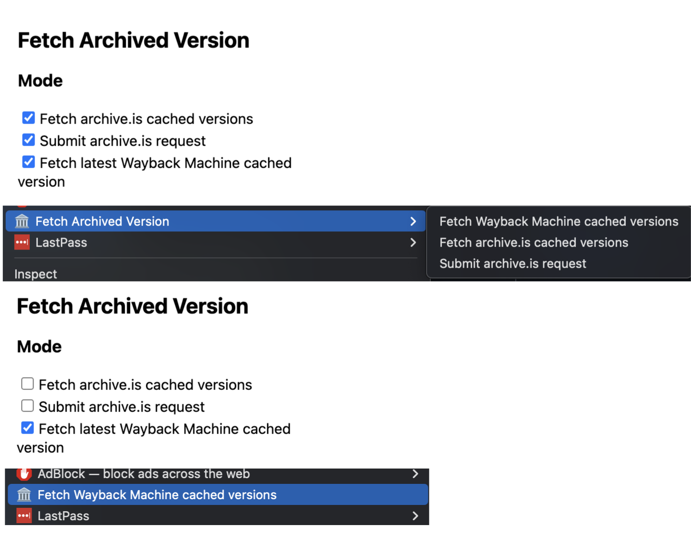

# Archive Context Menu Extension
Mostly copied from [Global Google Search context menu sample](https://github.com/GoogleChrome/chrome-extensions-samples/tree/main/api-samples/contextMenus/global_context_search) but to do different 💩! The only real differences between the Chrome and Firefox versions are

- slight differences in the main script eg. `chrome.runtime` vs. `browser.runtime`. There's probably cross-platform ways to deal with this but I'm lazy.
- the manifests, for some reason my Firefox is still stuck on manifest v2. 

## Overview

To specify what shows up in the context menu, click the 🏛️ extension icon in the top right, and select/deselect what you want.

## Running this extension/add-on

1. Clone this repository.
1. Chrome:
    - Load this directory in Chrome as an [unpacked extension](https://developer.chrome.com/docs/extensions/mv3/getstarted/development-basics/#load-unpacked).
1. Firefox:
    - Enter `about:debugging` into the URL bar, click the This Firefox option, click the Load Temporary Add-on button, then select any file in the `firefox` directory
1. Pin the extension to the taskbar to access the action button.
1. Open the extension popup by clicking the action button and interact with the UI.
1. Right click on any link and go to town
